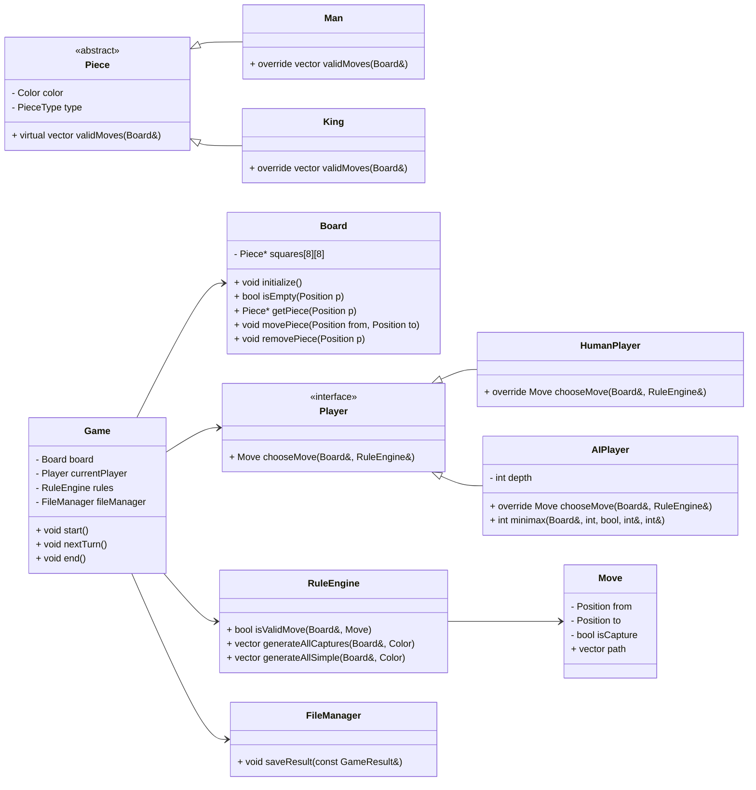

## Diagrama de Clases

```mermaid
classDiagram
    direction LR

    class Game {
        - Board board
        - Player currentPlayer
        - RuleEngine rules
        - FileManager fileManager
        + void start()
        + void nextTurn()
        + void end()
    }

    class Board {
        - Piece* squares[8][8]
        + void initialize()
        + bool isEmpty(Position p)
        + Piece* getPiece(Position p)
        + void movePiece(Position from, Position to)
        + void removePiece(Position p)
    }

    class Piece {
        <<abstract>>
        - Color color
        - PieceType type
        + virtual vector<Move> validMoves(Board&)
    }

    class Man {
        + override vector<Move> validMoves(Board&)
    }

    class King {
        + override vector<Move> validMoves(Board&)
    }

    class Move {
        - Position from
        - Position to
        - bool isCapture
        + vector<Position> path
    }

    class Player {
        <<interface>>
        + Move chooseMove(Board&, RuleEngine&)
    }

    class HumanPlayer {
        + override Move chooseMove(Board&, RuleEngine&)
    }

    class AIPlayer {
        - int depth
        + override Move chooseMove(Board&, RuleEngine&)
        + int minimax(Board&, int, bool, int&, int&)
    }

    class RuleEngine {
        + bool isValidMove(Board&, Move)
        + vector<Move> generateAllCaptures(Board&, Color)
        + vector<Move> generateAllSimple(Board&, Color)
    }

    class FileManager {
        + void saveResult(const GameResult&)
    }

    %% Relaciones
    Game --> Board
    Game --> Player
    Game --> RuleEngine
    Game --> FileManager
    Piece <|-- Man
    Piece <|-- King
    Player <|-- HumanPlayer
    Player <|-- AIPlayer
    RuleEngine --> Move
```
